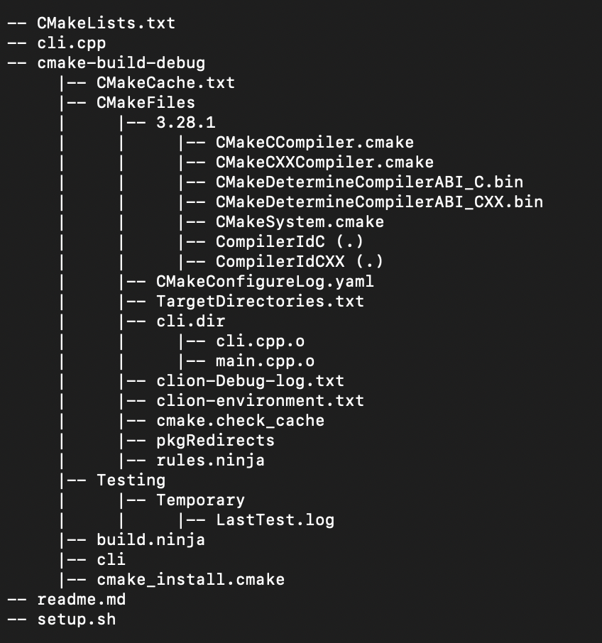

# CLI tool for printing file structure

## Usage

Call `lst` followed by the directory you want to print. By passing no arguments the 
current directory will be used. It should print something like this:

## Installation and setup

Run these commands in the directory you want to clone the repo:

    git clone https://github.com/torbjro/lst_cli_tool.git
    cd lst_cli_tool
    bash setup.sh

The script `setup.sh` is used to make the `lst` command usable.
The script will compile the code, create an alias in the 
`~/.basrc` file and source it. Note that if you use another
shell, the `~/.bashrc` needs to be changed to the equivalent 
for your shell. For instance, if using zsh it should be changed to 
`~/.zshrc`.

Now, the command should be callable with this syntax:

`lst [directory_path]`

Directory path is optional, and if the directory path is not specified, 
the current directory will be used.

## Disclaimer

The code makes use of `popen` and `pclose` system calls
that are specific to Unix systems. If using an OS that is
not Unix-like, these would need to be changed in order to
create a pipe to facilitate inter-process communication.
For Windows there are APIs like `CreatePipe` or `_popen` 
that provide similar functionalities.

## Bugs

The code will currently fail if trying to display directories
that have names with spaces. Furthermore, the code is not extensively
tested, so there is certainly more bugs to be discovered.
